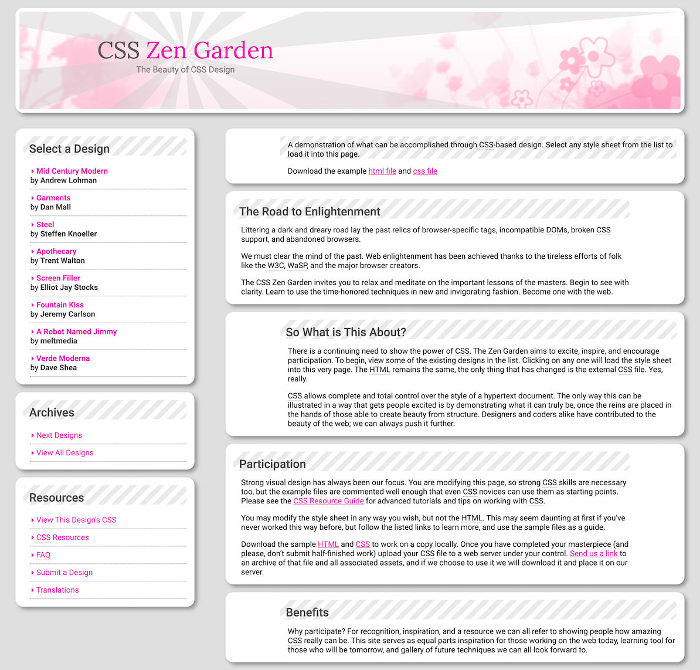

# CSS Zen Garden clone

> Final result on my screen

## Overview

The purpose of this activity is to match the following image using HTML and CSS without the help of any framework. The main focus is layout, text placement and spacing, so background image is not the same as in the reference picture.

